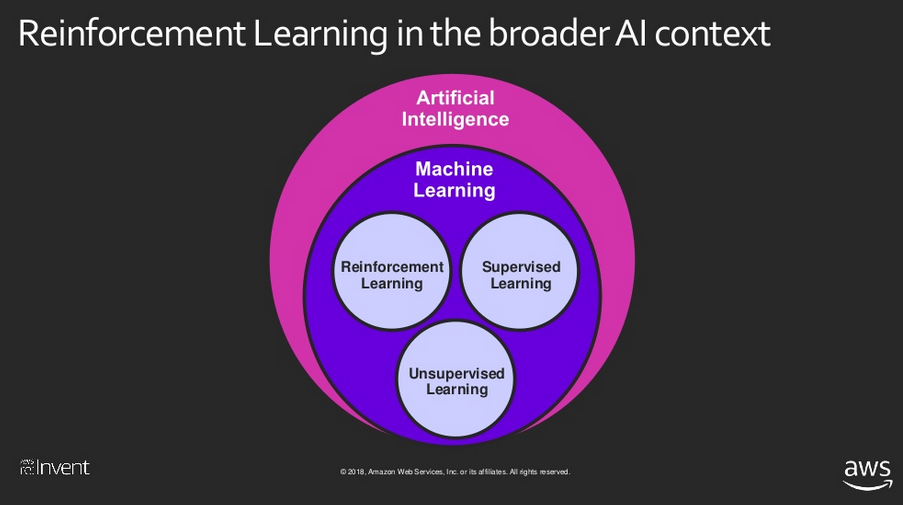

### Research note about Amazon Deepracer

### Reference
[DeepRacer latest developer guide](https://docs.aws.amazon.com/deepracer/latest/developerguide/awsracerdg.pdf#%5B%7B%22num%22%3A565%2C%22gen%22%3A0%7D%2C%7B%22name%22%3A%22XYZ%22%7D%2C72%2C416.96%2Cnull%5D)

[Deepracer workshops](https://www.slideshare.net/AmazonWebServices/new-launch-repeat-1-aws-deepracer-workshops-a-new-fun-way-to-learn-reinforcement-learning-aim206r1-aws-reinvent-2018)

[RoboMaker로 DeepRacer 자율주행차 만들기](https://www.youtube.com/watch?v=v5GBUpVkZbY)

### DeepRacer 개요
- Signup AWS and create IAM

### DeepRacer 아키텍처 (SW)

- Access permissions (Lambda, SageMaker, RoboMaker, CloudFormation)
- Train 머신러닝: Frameworks & Algorithm
    - AWS deepRacer console
        - process:
    - AWS sagemaker notebook
        - process:
- Reinforcement Learning

### DeepRacer 아키텍처 (HW)

- specification:
- set up vehicle:
- build track:
- factory reset:

### 주행

- 수동주행:
- 자동주행:

### 무선연결

